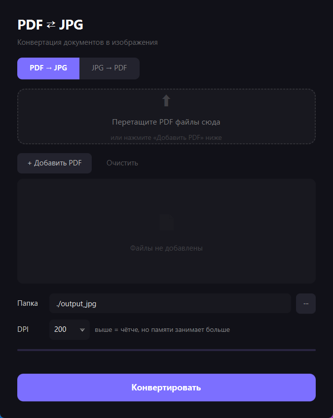
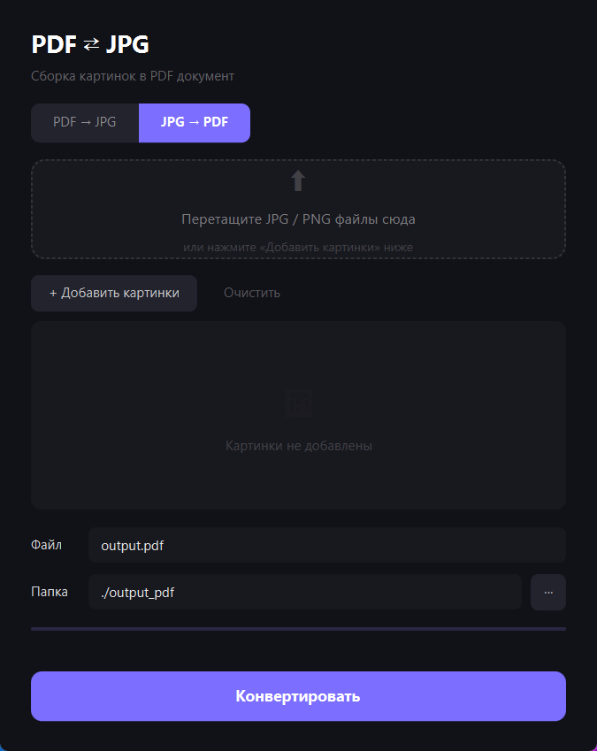

<h1 align="center">
  $\color{Orchid}{\text{PDF}}$ $\color{Magenta}{\text{⇄}}$ $\color{Orchid}{\text{JPG Конвертер}}$
</h1>
<h3>
  $\color{Magenta}{\text{Десктопная утилита для конвертации PDF документов в JPG изображения и обратной сборки картинок в PDF}}$
</h3>
<h3 align="center">
$\color{Magenta}{\text{конвертация одного или нескольких PDF/Images файлов за раз}}$
  </h3>

  [Последний релиз этого декстопного приложения](https://github.com/AndrewLuminous/pdf-to-jpg/releases)
<br>
<br>

  
<h3 align="center">
  $\color{Magenta}{\text{Декомпозиция приложения}}$
</h3>





<br><br><br>
<h1 align="center">
$\color{Orchid}{\text{Возможности}}$
</h1>
<p align="center">
  <br><br><br><br>
  $\color{Magenta}{\huge\text{PDF → JPG}}$
  <br><br><br><br>
</p>
<p align="center">
  $\color{Orchid}{\textbf{Поддержка многостраничных PDF — каждая страница сохраняется отдельным файлом}}$
  $\color{Orchid}{\textbf{настраиваемый DPI (72 / 100 / 150 / 200 / 300), выбор папки вывода}}$
   <br><br><br><br>
  $\color{Magenta}{\huge\text{JPG → PDF}}$
   <br><br><br><br>
</p>
<p align="center">
  <br>
  $\color{Orchid}{\text{Сборка изображений в один PDF документ}}$
  <br>
  $\color{Orchid}{\text{Страницы сохраняются по натуральной сортировке —}}$
  <br>
  $\color{Orchid}{\text{из набора сканов получается одна готовая книга 📚}}$
  <br>
</p>

<h2>
  $\color{Magenta}{\huge\textbf{Разработка и Сборка}}$
</h2>

<p>
  $\color{Orchid}{\text{Запуск в режиме разработки:}}$
</p>


```bash
mvn javafx:run
```
<p>
$\color{Orchid}{\text{Сборка установщика .exe:}}$
  </p>
  
```bash
mvn clean package
mvn jpackage:jpackage
```

<h2>
  $\color{Magenta}{\huge\textbf{ Результаты сборки и Логи}}$
</h2>

```text
Версия в
target/dist/PdfToJpg-*.*.*.exe
```

Логирование (Консоль + Файл):
```text
logs/pdf-to-jpg.log
```

Уровни логирования:
- DEBUG: для основного кода приложения
- WARN : для сторонних библиотек

<h1>
  $\color{Magenta}{\huge\textbf{ Демонстрация работы}}$
</h1>

